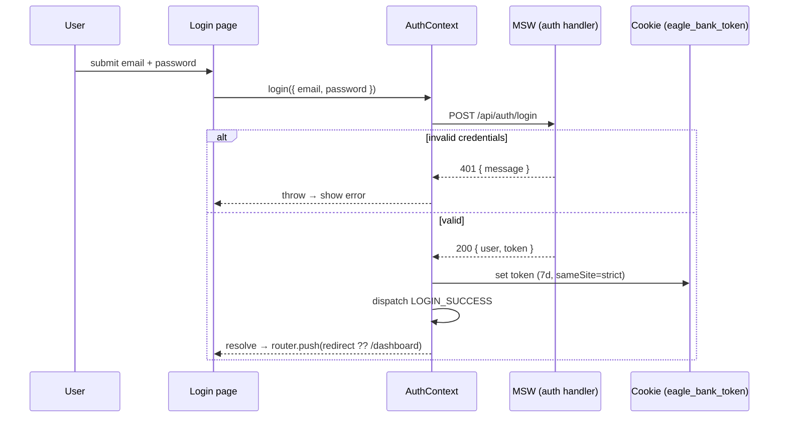
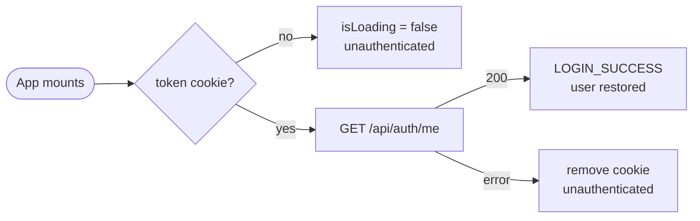
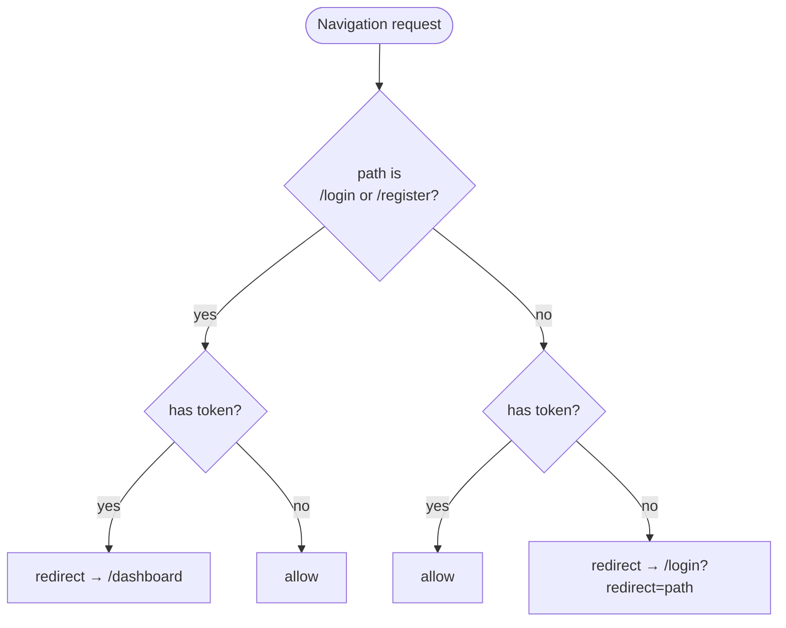

# Authentication & route protection

## Login → session

## Session rehydration on mount

## Proxy guard (per navigation)

> The token cookie is set by `js-cookie` (readable by `proxy.ts`). For a real backend this would become an `HttpOnly` server-set cookie validated server-side.
