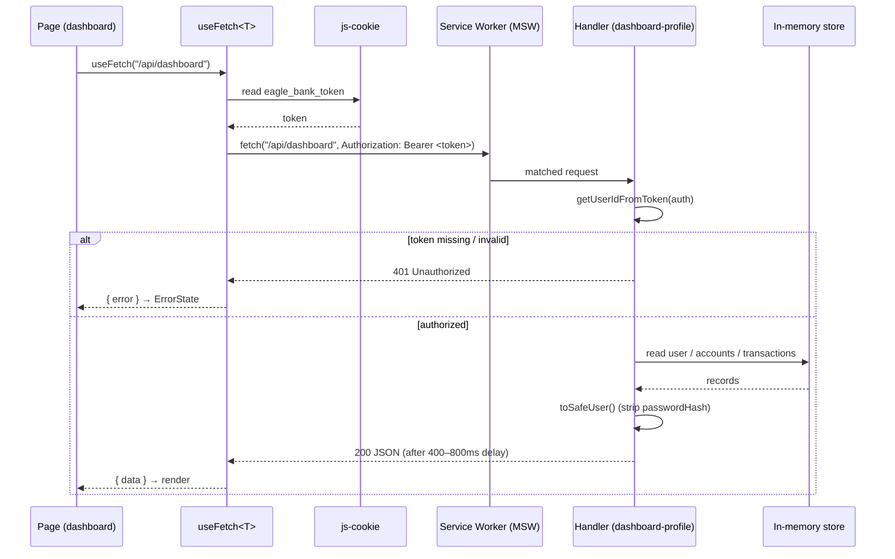

# Request lifecycle

How a data request flows from a page to the mock API and back. Example: loading the dashboard.

While the request is in flight, `useFetch` exposes `isLoading`, so the page shows skeleton placeholders. Mutations (e.g. profile update) follow the same path through `authFetch<T>`.
