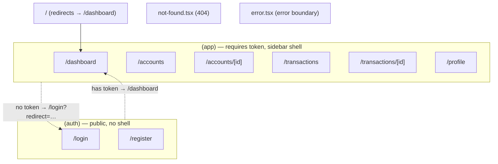

# Route map

Route groups separate the public auth shell from the authenticated app shell. The dotted boundary is enforced by `src/proxy.ts`.

| Group | Layout | Auth |
|---|---|---|
| `(auth)` | `app/(auth)/layout.tsx` (split panel) | Public; redirects to `/dashboard` if already signed in |
| `(app)` | `app/(app)/layout.tsx` (sidebar shell) | Protected by `proxy.ts` |
