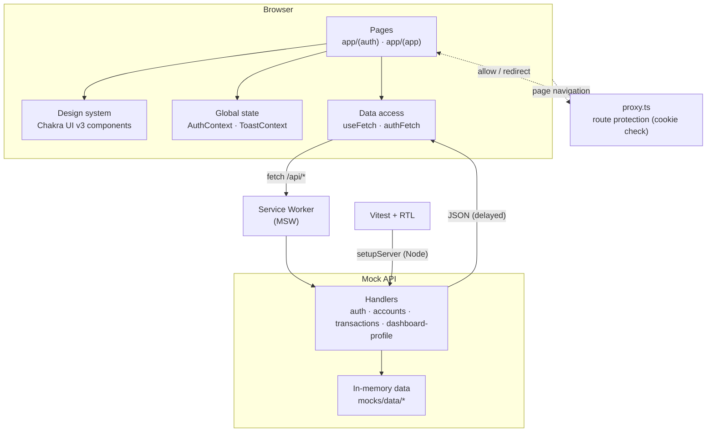

# System architecture

High-level view of how the app is layered. There is no real backend — MSW is the network boundary.

**Notes**
- The same handler set is consumed by the browser worker (`mocks/browser.ts`) and the Node server used in tests (`mocks/server.ts`).
- `proxy.ts` (Next.js 16's renamed middleware) runs on navigations only; `fetch('/api/*')` calls are intercepted client-side by the Service Worker before reaching the network.
